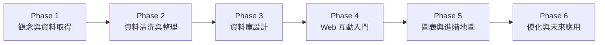
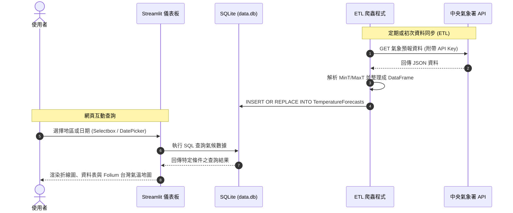

# 🌦️ Taiwan Weather Forecast 台灣天氣預報互動儀表板

> **AI 創新微課程：從氣象資料到互動式天氣預報應用**  
> *用程式探索天氣 · 用資料看見台灣 · 用 AI 實現更多可能*  
> *Code Smarter, Build a Better Tomorrow!*

---

> 「技術可以解決問題，但更重要的是用技術創造更好的未來！」—— 煥哥


---

## 📌 專案簡介 (Project Overview)

本專案為 **AI 創新微課程** 之實戰作品。透過串接**交通部中央氣象署（CWA）Open Data API**，取得台灣各區域最新氣象預測數據，經過 JSON 解析、Pandas 資料整理後儲存至 SQLite 本地資料庫。最後以 **Streamlit** 搭配 **Folium** 地圖庫，打造出具備互動式選單、溫差折線趨勢圖、數據報表與台灣各區動態氣溫地圖的完整 Web 視覺化儀表板。

---

## 🛠️ 核心技術棧 (Tech Stack)

| 領域 / 元件 | 技術 & 工具 | 說明 |
| :--- | :--- | :--- |
| **資料來源** | [中央氣象署開放資料平臺 (CWA Open Data)](https://opendata.cwa.gov.tw/) | 氣象預報開放 API，獲取即時與一週預報資料 |
| **程式語言** | **Python 3.9+** | 專案核心開發語言 |
| **網路請求** | **Requests** | 發送 HTTP GET 請求並取得 JSON 格式氣象數據 |
| **資料分析** | **Pandas** | JSON 攤平、DataFrame 資料清洗與型態轉換 |
| **資料庫** | **SQLite3** | 輕量化關聯式資料庫，儲存分區與日期氣溫紀錄 |
| **Web 框架** | **Streamlit** | 高效快速構建資料科學與視覺化互動 Web App |
| **地圖視覺化** | **Folium / streamlit-folium** | 台灣分區地理圖層繪製與溫度階梯色彩可視化 |
| **版本控制** | **Git / GitHub** | 專案版本管控、開源與協同開發 |

---

## 🗺️ 學習地圖與 24 單元架構 (Course Curriculum)



### 📍 第一階段：基礎認知與資料取得
- **單元 01：課程介紹** —— AI × 資料 × 天氣 × 實作目標與專案展示
- **單元 02：台灣的天氣與生活** —— 氣象的重要性、資料驅動決策與智慧應用
- **單元 03：中央氣象署 CWA Open Data 平台** —— 註冊帳號、申請 API Key 與選定資料集
- **單元 04：API 資料取得** —— 使用 Python `requests` 模組帶入 Authorization Header 抓取 JSON

### 📍 第二階段：資料清洗與結構化
- **單元 05：JSON 資料結構解析** —— 逐層解析回傳階層，定位 `locationName` 與 `weatherElement`
- **單元 06：提取最高與最低氣溫** —— 萃取 `MinT`、`MaxT` 與對應時間戳記
- **單元 07：資料整理與預覽** —— 使用 `pandas.DataFrame` 檢視分區、日期與氣溫表格

### 📍 第三階段：資料庫設計與管理
- **單元 08：建立 SQLite 資料庫** —— 建立 `data.db` 資料庫與連線
- **單元 09：資料庫設計** —— 設計 `TemperatureForecasts` 表結構 (Schema)
- **單元 10：查詢資料驗證** —— 撰寫 SQL 語法驗證資料正確性與去重檢核

### 📍 第四階段：Streamlit 互動介面初探
- **單元 11：Streamlit 入門** —— 環境設定、核心概念與 Hello World 快速體驗
- **單元 12：從資料庫讀取資料** —— 使用 `pd.read_sql_query` 與 SQLite 讀取查詢結果
- **單元 13：下拉選單選擇地區** —— `st.selectbox` 實作北部/中部/南部/東部等動態分區篩選

### 📍 第五階段：圖表繪製與 Web 介面整合
- **單元 14：繪製折線圖** —— 一週最高溫 (MaxT) 與最低溫 (MinT) 趨勢曲線
- **單元 15：顯示資料表格** —— `st.dataframe` 格式化呈現一週預報數值
- **單元 16：整合 Web App 介面** —— 整合篩選區塊、指標卡片、走勢圖與數據明細

### 📍 第六階段：進階地圖與完整儀表板
- **單元 17：進階：台灣地圖視覺化** —— 結合 Folium 與各區溫標色階呈現台灣地圖
- **單元 18：選擇日期顯示地圖** —— 依使用者選擇日期動態更新地圖各分區氣溫標記
- **單元 19：完整成果展示** —— 打造具備專業質感的 Taiwan Weather Dashboard

### 📍 第七階段：品質優化、Git 管理與未來延伸
- **單元 20：程式碼品質與優化** —— 模組化設計、例外處理 (`try-except`)、避免重複入庫
- **單元 21：專案上傳至 GitHub** —— Git 初始化、設定遠端庫、Commit 與 Push 流程
- **單元 22：延伸應用與想法** —— 天氣提醒 LINE Bot、旅遊推薦、農業防災與 AI 整合分析
- **單元 23：回顧與重點整理** —— 完整 AI × Coding 實作流程重點盤點
- **單元 24：下一步：繼續探索** —— 開放資料應用、AI 輔助開發，打造個人的專屬作品

---

## 🗄️ 資料庫結構設計 (Database Schema)

資料庫採用 SQLite (`data.db`)，資料表為 `TemperatureForecasts`：

```sql
CREATE TABLE IF NOT EXISTS TemperatureForecasts (
    id INTEGER PRIMARY KEY AUTOINCREMENT,
    regionName TEXT NOT NULL,       -- 地區名稱 (如：北部地區、中部地區、南部地區等)
    dataDate TEXT NOT NULL,         -- 預報日期 (YYYY-MM-DD)
    mint REAL,                      -- 最低氣溫 (°C)
    maxt REAL,                      -- 最高氣溫 (°C)
    UNIQUE(regionName, dataDate)    -- 避免重複執行寫入重複數據
);
```

### 常見 SQL 驗證查詢
```sql
-- 查詢所有不重複地區
SELECT DISTINCT regionName FROM TemperatureForecasts;

-- 查詢指定地區的一週氣溫預報
SELECT dataDate, mint, maxt 
FROM TemperatureForecasts 
WHERE regionName = '中部地區' 
ORDER BY dataDate ASC;
```

---

## 🏗️ 系統運作流程 (System Architecture)



---

## 🚀 快速開始 (Quick Start)

### 1. 取得中央氣象署 API 授權碼
1. 前往 [中央氣象署開放資料平臺](https://opendata.cwa.gov.tw/)。
2. 註冊並登入會員帳號。
3. 於「會員資訊」中取得專屬 **API 授權碼 (Authorization Key)**。

### 2. 下載專案與安裝依賴套件

```bash
# 複製專案庫
git clone https://github.com/oscaryoyo/AIOTL3_CWA.git
cd AIOTL3_CWA

# 建立並啟動 Python 虛擬環境 (建議)
python -m venv venv
# Windows:
venv\Scripts\activate
# macOS / Linux:
source venv/bin/activate

# 安裝所需套件
pip install requests pandas streamlit folium streamlit-folium plotly python-dotenv
```

### 3. 環境變數設定
建立 `.env` 檔案並填入您的 API 授權金鑰：
```ini
CWA_API_KEY=YOUR_CWA_API_KEY_HERE
```

### 4. 執行資料爬取與入庫
```bash
python fetch_data.py
```

### 5. 啟動 Streamlit 視覺化儀表板
```bash
streamlit run app.py
```
啟動成功後，瀏覽器將自動開啟 `http://localhost:8501`。

---

## 🌐 Vercel 雲端部署指南 (Vercel Deployment)

本專案已包含 `vercel.json` 部署設定檔，支援一鍵將 GitHub 儲存庫部署至 Vercel 雲端平台：

1. **登入 Vercel**：前往 [Vercel Dashboard](https://vercel.com/) 並以您的 GitHub 帳號登入。
2. **匯入專案 (Import Project)**：
   - 點擊 **"Add New..."** ➔ **"Project"**。
   - 選擇您的 GitHub 儲存庫 `oscaryoyo/AIOTL3_CWA`。
3. **設定環境變數 (Environment Variables)**：
   - 在 **Environment Variables** 欄位新增：
     - `Key`: `CWA_API_KEY`
     - `Value`: `您的中央氣象署 API 金鑰` (如 `CWA-55FDA6D3-A43C-4AE0-BB30-E62D5F684FB2`)
4. **發布部署 (Deploy)**：
   - 點擊 **Deploy**，Vercel 將自動辨識 `vercel.json` 與 `requirements.txt` 並完成雲端部署。


---

## 💡 延伸應用 (Future Roadmap)

- [ ] **天氣預警 LINE Bot / Telegram 機器人**：每日早晨自動推播今日氣溫、攜帶雨具提醒。
- [ ] **旅遊休閒建議系統**：結合降雨機率與舒適度指數，智慧推薦本週適合出遊的分區。
- [ ] **智慧農業 / 防災監控**：當連續低溫寒害或強降雨警報發布時，發送緊急通報。
- [ ] **結合生成式 AI (LLM)**：運用 OpenAI / Claude / Gemini API，自動生成口語化即時天氣主播講稿與出門穿搭建議。

---

## 👨‍🏫 關於微課程 (About)

- **課程名稱**：AI 創新微課程 - Taiwan Weather Forecast
- **講師理念**：*「技術可以解決問題，但更重要的是用技術創造更好的未來！」—— 煥哥*
- **精神標語**：Learn Today, Build Tomorrow | AI for Learning, AI for a Better Taiwan
