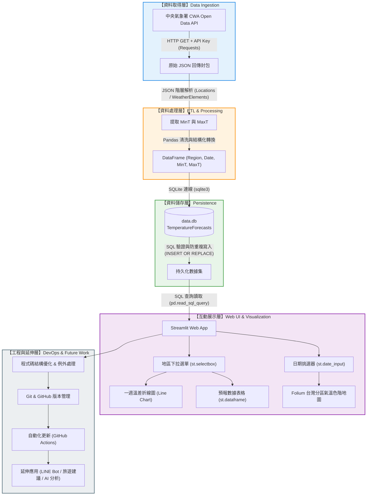
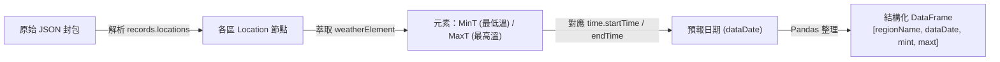
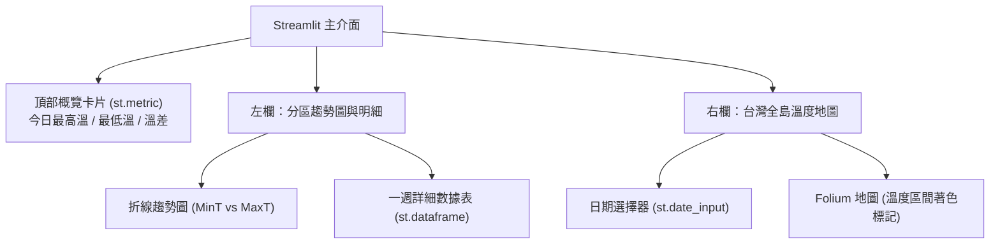

# 🔄 Taiwan Weather Forecast 完整開發工作流程 (Development Workflow)

> 本文件依據 **「AI 創新微課程：從氣象資料到互動式天氣預報應用」** 24 個單元之教學與實作藍圖所編制。  
> 涵蓋從 API 資料擷取、ETL 清洗、資料庫存儲、Streamlit 互動應用，到 Folium 地圖可視化與 GitHub 版本控管的完整實作管線。

---

## 🧭 全景系統架構工作流程圖 (End-to-End Architecture)



---

## 📋 24 單元階段式實作工作流程 (Step-by-Step Implementation Workflow)

### 階段一：需求調研與 API 串接 (單元 01 ~ 04)
**目標**：建立專案環境、申請 CWA 權杖，並成功透過 Python 發送請求取得 JSON 天氣資料。

1. **環境準備**：
   - 建立 Python 虛擬環境 (`python -m venv venv`)。
   - 安裝基礎網路套件：`requests`、`python-dotenv`。
2. **申請 CWA API Key**：
   - 至 [中央氣象署開放資料平臺](https://opendata.cwa.gov.tw/) 註冊並取得授權金鑰。
   - 於專案根目錄建立 `.env` 檔案儲存：`CWA_API_KEY=YOUR_KEY`。
3. **API 請求實作 (`requests`)**：
   - 指定資料集代碼（如一般天氣預報資料集）。
   - 帶入 Header 或 Query Parameter 傳遞 Authorization Key。
   - 檢查 HTTP Status Code 是否為 `200`，並將回應轉為 Python 字典物件 (`resp.json()`)。

---

### 階段二：JSON 階層解析與資料清洗 (單元 05 ~ 07)
**目標**：拆解巢狀 JSON，萃取目標欄位並轉為乾淨的 Pandas DataFrame。



1. **定位目標資料**：
   - 走訪 `records -> locations -> location` 陣列。
   - 取得分區名稱 `locationName`（北部、中部、南部、東部等）。
2. **提取數值型態指標**：
   - 提取 `MinT`（最低氣溫）與 `MaxT`（最高氣溫）之數值，轉換為 `float`。
   - 格式化時間字串為 `YYYY-MM-DD`。
3. **Pandas 驗證**：
   - 使用 `pd.DataFrame(...)` 組合資料。
   - 執行 `df.info()` 與 `df.head()` 檢查有無缺漏值 (NaN)。

---

### 階段三：SQLite 資料庫儲存與防重機制 (單元 08 ~ 10)
**目標**：設計關聯式資料庫結構，建立不重複寫入的 ETL 儲存機制。

1. **資料表 Schema 設計**：
   ```sql
   CREATE TABLE IF NOT EXISTS TemperatureForecasts (
       id INTEGER PRIMARY KEY AUTOINCREMENT,
       regionName TEXT NOT NULL,
       dataDate TEXT NOT NULL,
       mint REAL,
       maxt REAL,
       UNIQUE(regionName, dataDate)
   );
   ```
2. **資料批次寫入 (Upsert)**：
   - 使用 `INSERT OR REPLACE INTO TemperatureForecasts` 或 `INSERT OR IGNORE`，確保重複執行爬蟲時不會造成重複記錄。
3. **SQL 語法驗證**：
   - `SELECT DISTINCT regionName FROM TemperatureForecasts;` 確認包含所有地區。
   - `SELECT * FROM TemperatureForecasts WHERE regionName = '中部地區';` 確認一週天數數據完整。

---

### 階段四：Streamlit 互動介面初探 (單元 11 ~ 13)
**目標**：以最少程式碼打造 Web 互動操作介面。

1. **Streamlit 基礎框架建立 (`app.py`)**：
   - 設定頁面標題與佈局：`st.set_page_config(page_title="Taiwan Weather", layout="wide")`。
   - 加入標題與副標題：呈現煥哥的課程金句與專案理念。
2. **資料庫連線查詢函式**：
   - 透過 `@st.cache_data` 快取機制優化查詢效能。
   - 使用 `pd.read_sql_query()` 讀取最新預報。
3. **互動式選單控制**：
   - 使用 `st.selectbox("選擇地區", regions)` 提供使用者切換北部、中部、南部、東北部、東部、東南部。

---

### 階段五：視覺化圖表、表格與地圖整合 (單元 14 ~ 19)
**目標**：多維度呈現天氣資訊，結合趨勢圖、數據表與 Folium 台灣地理色階地圖。



1. **繪製最高/最低溫折線圖**：
   - 繪製雙折線（最高溫紅線、最低溫藍線），X 軸為日期，Y 軸為溫度 (°C)。
2. **資料表格格式化**：
   - 清晰展示 `日期`、`最低溫`、`最高溫` 及 `溫差` 欄位。
3. **進階 Folium 地圖可視化**：
   - 定位台灣地理中心座標 (`[23.7, 121.0]`)。
   - 依據平均溫度計算色階標籤：
     - `< 20°C`：深藍色（涼爽 / 寒冷）
     - `20 ~ 25°C`：綠色（舒適）
     - `25 ~ 30°C`：橙色（溫暖 / 偏熱）
     - `> 30°C`：紅色（炎熱）
   - 使用 `st_folium` 渲染地圖，點擊標記可查看該分區當日氣溫。

---

### 階段六：品質優化、Git 管理與未來拓展 (單元 20 ~ 24)
**目標**：工程化重構、版本管理及未來 AI/IoT 整合應用。

1. **程式碼品質重構**：
   - 模組化拆分：`fetch_data.py` (ETL 爬蟲) 與 `app.py` (UI 前端) 權責分離。
   - 增加完整 `try-except-finally` 與日誌紀錄 (`logging`)。
2. **Git 版本控制流程**：
   - 維護 `.gitignore` 避免金鑰及本地資料庫外洩。
   - 遵循清晰的 Commit Message 規範。
   - 推送至遠端 GitHub 儲存庫進行協作。
3. **未來智慧擴充**：
   - **LINE Notify / Bot**：每天早晨推播今日穿衣提醒與降雨警報。
   - **LLM AI 氣象主播**：透過 Prompt 工程將數據轉換為口語化生活提醒。

---

## 🗂️ 建議專案目錄規劃 (Recommended Project Structure)

```text
AIOTL3_CWA/
├── .github/
│   └── workflows/
│       └── update_weather.yml    # (選用) GitHub Actions 定期自動排程爬取
├── data/
│   └── data.db                   # SQLite 資料庫 (由 .gitignore 忽略)
├── .env.example                  # 環境變數範例檔
├── .gitignore                    # Git 忽略清單
├── README.md                     # 專案介紹與課程導覽
├── WORKFLOW.md                   # 系統與開發工作流程手冊 (本檔案)
├── requirements.txt              # Python 相依套件清單
├── fetch_data.py                 # ETL 爬蟲：API 請求、JSON 解析與資料入庫
└── app.py                        # Streamlit 主程式：互動介面、圖表與 Folium 地圖
```

---

## ⚙️ 常用工作流程命令速查 (Workflow Cheatsheet)

| 工作階段 | 命令列指令 | 目的 |
| :--- | :--- | :--- |
| **環境初始化** | `python -m venv venv && .\venv\Scripts\activate` | 建立並啟動虛擬環境 |
| **套件安裝** | `pip install -r requirements.txt` | 安裝專案所需第三方套件 |
| **執行 ETL** | `python fetch_data.py` | 抓取氣象署最新數據並存入 SQLite |
| **啟動 Web** | `streamlit run app.py` | 開啟本機 Streamlit 視覺化服務 |
| **提交代碼** | `git add . && git commit -m "feat: update dashboard"` | 本地 Git 提交 |
| **推送代碼** | `git push origin main` | 同步至 GitHub 遠端儲存庫 |
